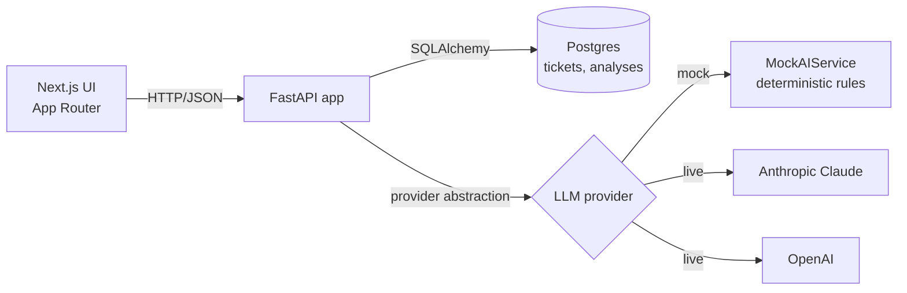

# Support Ticket Triage

A full-stack support triage platform. Inbound customer tickets are classified,
prioritised, summarised, and answered with a suggested reply — surfaced
through a polished operations dashboard with KPIs, filters, and a typed
detail view.

The stack runs end-to-end **without an API key** thanks to a built-in
deterministic mock provider. Set `USE_MOCK_AI=false` and supply an
`ANTHROPIC_API_KEY` or `OPENAI_API_KEY` to switch providers; nothing else
changes.

<p>
  
  
  
  
  
  
</p>

---

## Screenshots

Captures live in `docs/screenshots/`. Drop new ones in and the tables below
update automatically.

| Dashboard | Ticket detail with analysis |
| --- | --- |
|  |  |

| Ticket queue | Dark mode |
| --- | --- |
|  |  |

After `bash scripts/seed.sh`, the dashboard and queue are immediately
screenshot-ready.

---

## Why this project

Support inboxes are a classic LLM use case but a bad one to ship naively:
hallucinated categories pollute reporting, hallucinated replies erode trust,
and analysis that lives in a chat thread can't be filtered, audited, or
queried. The interesting engineering work isn't the prompt — it's the
contract around the model and the surface around it.

This repo implements that pipeline end to end:

- **Ingestion** — tickets are created via API or UI with a typed schema.
- **Analysis** — a provider-abstracted service returns a strict
  `TicketAnalysis` object: category, priority, summary, suggested response,
  reasoning, and a confidence score.
- **Persistence** — analyses are upserted onto tickets with a `force` flag
  for regeneration; categories and priorities are enum-constrained so
  reporting stays consistent.
- **Surface** — operations dashboard with KPI cards, filterable queue,
  ticket detail with analysis panel, status workflow.

Mock mode is a deliberate design choice: the full product — classification,
filters, analytics, suggested replies — works without external dependencies,
so the project clones cleanly and runs with a single command.

---

## Technical highlights

| Area | What's done | Why it matters |
| --- | --- | --- |
| Architecture | Layered backend: thin routes, service layer, repository layer, provider layer. | Routes never touch SQLAlchemy or a vendor SDK. Services are reusable in tests, scripts, and future workers. |
| Provider abstraction | `LLMService` picks `mock`, `anthropic`, or `openai` from settings at request time. Output is validated against `TicketAnalysis` via Pydantic. | Swapping providers is one env var. Drift in model output surfaces as a typed error, not a `KeyError` in a route. |
| Strict enums | `Category`, `Priority`, `Status` are Python enums on the backend and string-literal unions on the frontend. | Reporting stays clean; the dashboard's filters and aggregations can't drift from the schema. |
| Upsert + force semantics | `POST /tickets/{id}/analyze` upserts the analysis; `force=true` regenerates the suggested reply without creating a new row. | Re-running analysis on a ticket is idempotent and safe; no orphan rows. |
| Error contract | Domain exceptions are mapped to a typed `{error: {code, message, details}}` body via a single FastAPI exception handler. | Frontend branches on `error.code`. No 500s leak stack traces. |
| Observability | `structlog` plus a request-id middleware. Every log line carries request id, method, path, status, duration. | Logs correlate to a single request without a tracing dependency. |
| Testing | Pytest fixtures swap Postgres for SQLite. The suite covers mock classification correctness, end-to-end ticket CRUD, filter/search behaviour, analyze upsert + force semantics, status transitions, analytics aggregation, and seed idempotency. | The whole suite runs in CI with zero external services. |
| Frontend | shadcn-style primitives, lucide icons, Tailwind tokens for light + dark via CSS variables, optimistic updates, toast feedback. | Looks like a product, not a prototype. |
| Mock classifier | Cue-phrase matchers for category and priority, deterministic summary + suggested-reply templates per category, confidence based on signal density. | The mock isn't a placeholder — it produces realistic structured output so the UI feels real on first launch. |

---

## Architecture



Three deployable units — frontend, backend, database — orchestrated with
`docker compose`. The backend owns the API contract; the frontend is a thin
client.

```
backend/app/
  core/           settings, structlog, error envelope
  api/routes/     thin HTTP adapters (tickets, analytics, health)
  schemas/        Pydantic request/response models
  models/         SQLAlchemy ORM (Ticket, TicketAnalysis)
  repositories/   DB access only (no business rules)
  services/       business logic: ticket, analysis, llm, analytics, seed
  db/             engine, session, declarative base
  main.py         FastAPI factory + lifespan (seed on startup)
```

Sequence diagrams for analyze and the at-scale considerations are in
[`docs/architecture.md`](docs/architecture.md).

---

## Demo flow

```bash
# 1. Boot the stack. Backend auto-seeds 8 realistic tickets on first boot.
cp .env.example .env
docker compose up --build
```

Then in the browser:

1. **Dashboard** (http://localhost:3000) — KPI cards (Total, Critical,
   Avg. confidence, Resolved) populate from the seed data. The
   "Highest-priority tickets" panel surfaces what it flagged.
2. **Open a critical ticket** — e.g. *"Production down — 500s on all checkout
   requests."* The right column has status / priority / category controls;
   the center column shows the customer message and a populated analysis
   card with summary, suggested response, reasoning, and confidence meter.
3. **Re-run analysis** — the "Re-run" button calls `analyze` with
   `force=true` to regenerate the suggested response without creating a new
   row.
4. **Queue & filters** — *Tickets* in the sidebar. Filter by
   `Priority = Critical` or `Category = Billing`.
5. **Create a ticket** — *New ticket*. Click *Fill with example* first, then
   submit and watch the analysis panel populate on the detail page.
6. **Flip to a live model** *(optional)*:
   ```
   USE_MOCK_AI=false
   AI_PROVIDER=anthropic
   ANTHROPIC_API_KEY=sk-ant-…
   ```
   Restart the backend. The top-bar badge changes from *Mock mode* to
   *Live · anthropic*.

---

## Local setup

### Option A — Docker (recommended)

```bash
cp .env.example .env             # tweak ports if needed
docker compose up --build
```

| Service   | URL                              |
| --------- | -------------------------------- |
| Frontend  | http://localhost:3000            |
| Backend   | http://localhost:8000            |
| API docs  | http://localhost:8000/docs       |
| Postgres  | localhost:5432                   |

The backend auto-seeds eight demo tickets the first time it starts (controlled
by `SEED_ON_STARTUP`).

### Option B — Run services manually

Requires Python 3.12 and Node 20+.

```bash
# 1. Postgres (or set DATABASE_URL=sqlite:///./dev.db in backend/.env)
docker run --name support-postgres -p 5432:5432 \
  -e POSTGRES_USER=support -e POSTGRES_PASSWORD=support -e POSTGRES_DB=support_ticket_assistant \
  -d postgres:16-alpine

# 2. Backend
cd backend
cp .env.example .env
python3.12 -m venv .venv && source .venv/bin/activate
pip install -r requirements.txt
uvicorn app.main:app --reload --port 8000

# 3. Frontend (new terminal)
cd frontend
cp .env.example .env.local
npm install
npm run dev
```

---

## API overview

All endpoints are documented interactively at http://localhost:8000/docs
(OpenAPI / Swagger) and http://localhost:8000/redoc.

| Method | Path                          | Description                                          |
| ------ | ----------------------------- | ---------------------------------------------------- |
| GET    | `/health`                     | Liveness + mock-mode indicator                       |
| POST   | `/tickets`                    | Create a ticket                                      |
| GET    | `/tickets`                    | List + filter (status, priority, category, search)   |
| GET    | `/tickets/{id}`               | Get a single ticket (with analysis)                  |
| PATCH  | `/tickets/{id}`               | Update status / priority / category                  |
| DELETE | `/tickets/{id}`               | Delete a ticket                                      |
| POST   | `/tickets/{id}/analyze`       | Run the analyzer (upsert semantics)               |
| GET    | `/analytics/summary`          | Dashboard KPIs                                       |

Every response carries an `X-Request-ID` header that matches the structured
log line for that request.

### Sample `analyze` response

```json
{
  "id": "9a1f…",
  "ticket_id": "1234…",
  "category": "technical_issue",
  "priority": "critical",
  "summary": "Production checkout returns HTTP 500 across the EU — customer reports a full outage.",
  "suggested_response": "Hi Priya,\n\nThanks for the detailed report. I'm sorry…",
  "reasoning_short": "Category technical_issue based on keywords: outage, 500. Priority critical based on phrases: production down, urgent.",
  "confidence_score": 0.92,
  "model_name": "claude-sonnet-4-6",
  "used_mock": false,
  "created_at": "2024-09-17T10:13:01.221Z"
}
```

### Error envelope

```json
{
  "error": {
    "code": "ai_provider_error",
    "message": "Model output did not match the TicketAnalysis schema.",
    "details": {}
  }
}
```

---

## Environment variables

Backend (`backend/.env`, template at `backend/.env.example`):

| Variable             | Default                                | Description                                          |
| -------------------- | -------------------------------------- | ---------------------------------------------------- |
| `DATABASE_URL`       | `postgresql+psycopg2://support:…`      | SQLAlchemy URL (Postgres or SQLite)                  |
| `USE_MOCK_AI`        | `true`                                 | Force the mock provider                              |
| `AI_PROVIDER`        | `anthropic`                            | `anthropic` or `openai`                              |
| `ANTHROPIC_API_KEY`  | *empty*                                | Required if `USE_MOCK_AI=false` and provider=anthropic |
| `ANTHROPIC_MODEL`    | `claude-sonnet-4-6`                    |                                                      |
| `OPENAI_API_KEY`     | *empty*                                | Required if `USE_MOCK_AI=false` and provider=openai  |
| `OPENAI_MODEL`       | `gpt-4o-mini`                          |                                                      |
| `CORS_ORIGINS`       | `http://localhost:3000`                | Comma-separated                                      |
| `SEED_ON_STARTUP`    | `true`                                 | Insert demo tickets on first boot if empty           |
| `LOG_LEVEL`          | `INFO`                                 | structlog level                                      |

Frontend reads `NEXT_PUBLIC_API_BASE_URL` (default `http://localhost:8000`).

---

## Tests

Backend tests use SQLite — no external services required.

```bash
cd backend
pytest -q
```

The suite covers:

- Mock classification correctness across categories and urgencies
- End-to-end ticket CRUD via the API
- Filter + search behaviour
- Analyze endpoint upsert + force semantics
- Status / priority updates
- Analytics summary aggregation
- Demo seed idempotency

Frontend tests:

```bash
cd frontend
npm test
```

GitHub Actions runs the backend suite on every push and PR
(`.github/workflows/backend-tests.yml`).

---

## Project structure

```
ai-support-ticket-assistant/
├── backend/                 FastAPI service
│   ├── app/
│   │   ├── api/routes/            tickets, analytics, health
│   │   ├── core/                  config, logging, errors
│   │   ├── db/                    engine, session, base
│   │   ├── models/                SQLAlchemy ORM
│   │   ├── repositories/          DB access
│   │   ├── schemas/               Pydantic schemas
│   │   ├── services/              ticket, analysis, llm, analytics, seed
│   │   └── main.py
│   ├── tests/                     pytest suite
│   ├── Dockerfile
│   └── requirements.txt
├── frontend/                Next.js 15 App Router
│   ├── app/                       Dashboard, Tickets, Ticket detail, New ticket
│   ├── components/                ui/ (shadcn), layout/, tickets/, dashboard/
│   ├── hooks/
│   ├── lib/                       api client, types, labels, utils
│   ├── tests/
│   └── Dockerfile
├── seed/
│   └── demo_tickets.json    Realistic SaaS support tickets
├── scripts/seed.sh          Upload demo data to a running backend
├── docs/architecture.md     Sequence diagrams + trade-offs
├── docker-compose.yml
└── .github/workflows/backend-tests.yml
```

---

## Limitations

Intentional v1 boundaries — none of them block a great demo, but they would
matter in production:

- **Single-tenant.** No auth, no orgs, no workspaces.
- **Synchronous analysis.** `POST /tickets/{id}/analyze` waits for the model
  reply. High-traffic deployments would run it on a queue.
- **No streaming.** Suggested responses appear in one chunk.
- **`Base.metadata.create_all` on startup.** Fine for a demo; Alembic for
  schema evolution.
- **No inbound channel adapter.** Tickets are created via form/API; a real
  product would ingest from email, Slack, Intercom, etc.

---

## Future improvements

- Async analysis with Celery / SQS + a websocket "analysis ready" push
- Streaming suggested responses over SSE
- Authentication and multi-tenancy (workspaces, RBAC)
- Reply feedback loop — agents accept / edit / reject, feeding prompt and
  model improvements
- Email + Slack ingest as the inbound channel
- Alembic migrations in place of `create_all`
- OpenTelemetry tracing and Prometheus metrics
- More providers (Azure OpenAI, local Ollama models)

---

## License

MIT — see [`LICENSE`](LICENSE). Built in 2024 as a portfolio project.
