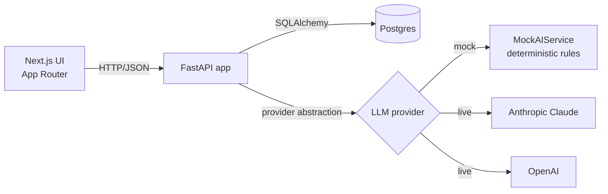
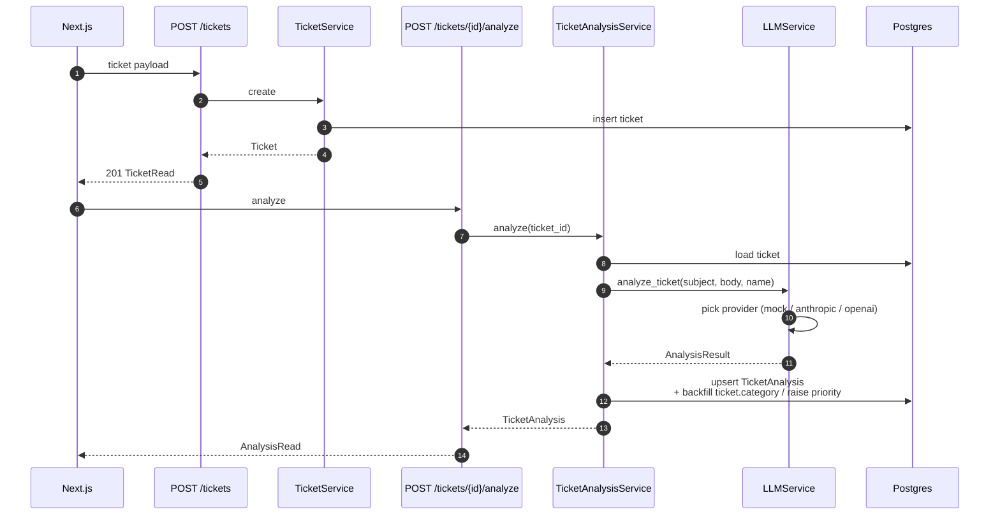

# Architecture

## High-level



Three deployable units — frontend, backend, and Postgres — orchestrated with
`docker compose`. The backend is the single source of truth for the API
contract; the frontend is a thin client.

## Backend layering

```
api/routes        ← thin HTTP adapters (tickets, analytics, health)
  └── services    ← business logic
        ├── repositories  ← DB access only
        └── llm_service   ← provider abstraction
              ├── mock_ai_service        (default)
              ├── _AnthropicProvider     (claude-sonnet-4-6 by default)
              └── _OpenAIProvider        (gpt-4o-mini by default)
schemas/          ← Pydantic request + response models
models/           ← SQLAlchemy ORM
db/               ← engine, session, declarative base
core/             ← settings, structured logging, error handlers
```

- **Routes** parse and validate requests, call a service, and return a Pydantic
  schema. They never touch SQLAlchemy directly.
- **Services** own business rules: ticket lifecycle, LLM orchestration, analytics
  aggregation.
- **Repositories** are the only place that constructs SQL queries.
- **LLM providers** all implement the same `_Provider` protocol. The factory
  inside `LLMService` chooses the implementation based on settings, with an
  automatic fallback to the mock when no key is configured.

## Data model

Two persistent tables, one-to-one:

```
tickets ─────────── 1 ── 0..1 ─── ticket_analyses
```

`tickets`:

| Column         | Type          | Notes                                                |
| -------------- | ------------- | ---------------------------------------------------- |
| id             | uuid (str)    | primary key                                          |
| subject        | str           |                                                      |
| body           | text          | full customer message                                |
| customer_email | str?          |                                                      |
| customer_name  | str?          |                                                      |
| category       | enum?         | inferred by the model on analysis if left blank by the user |
| priority       | enum          | defaults `medium`; can be raised by the analyzer               |
| status         | enum          | `open` / `in_progress` / `resolved`                  |
| created_at     | timestamptz   |                                                      |
| updated_at     | timestamptz   |                                                      |

`ticket_analyses`:

| Column             | Type        | Notes                                       |
| ------------------ | ----------- | ------------------------------------------- |
| id                 | uuid (str)  | primary key                                 |
| ticket_id          | uuid (str)  | FK to tickets, unique (one analysis/ticket) |
| category           | enum        |                                             |
| priority           | enum        |                                             |
| summary            | text        |                                             |
| suggested_response | text        | draft reply, signed "The Support Team"      |
| reasoning_short    | text        | one-sentence "why"                          |
| confidence_score   | float (0-1) |                                             |
| model_name         | str         | e.g. `claude-sonnet-4-6` or `mock-…`        |
| used_mock          | bool        |                                             |
| created_at         | timestamptz |                                             |

`TicketAnalysisService.analyze` uses upsert semantics — re-running keeps the
same row, so the API surface stays simple.

## Request flow: create + analyze



The post-analysis sync is important: the analyzer's category fills in unset values on
the ticket, and the analyzer's priority *can only raise* the ticket's priority. We
never silently downgrade a human's call.

## Provider abstraction

```
LLMService.analyze_ticket()
   ├── _MockProvider     ← deterministic keyword classifier
   ├── _AnthropicProvider ← Anthropic Messages API, JSON output
   └── _OpenAIProvider    ← OpenAI Chat Completions, JSON mode
```

Selection rules:

- If `USE_MOCK_AI=true` → mock.
- If the selected provider's API key is empty → mock (graceful demo mode).
- Otherwise → live provider, with a runtime fallback to the mock on any
  `AIProviderError`. This means a single misbehaving model call cannot crash
  the analysis flow.

All three providers return the same `AnalysisResult` dataclass, so the rest of
the app has no provider-specific code paths.

## Mock analyzer design

The mock is intentionally not random. It runs a small rule engine over the
ticket text:

- **Category** — keyword buckets per category (e.g. "refund", "invoice" →
  billing; "outage", "500" → technical_issue). The category with the most hits
  wins; default is "general_question".
- **Priority** — phrase rules in priority order (e.g. "production down",
  "data loss" → critical; "blocker", "deadline" → high; "minor", "cosmetic" →
  low). Default is "medium".
- **Summary** — subject + leading sentence of the body, length-capped.
- **Suggested response** — category-specific opener + actionable next step +
  conditional urgency note ("flagged internally as critical…").
- **Confidence** — `0.55 + 0.07·category_hits + 0.05·priority_hits + length
  bonus + deterministic jitter`, clamped to [0.4, 0.97]. Identical input gives
  the same score every time — useful for tests and for screenshots.

This is what makes the project portfolio-friendly: a reviewer can
`docker compose up` and see meaningful classifier behavior immediately, without
procuring an API key.

## Frontend

```
app/
  page.tsx                ← Dashboard (KPIs + queue snapshot + breakdowns)
  tickets/page.tsx        ← Ticket queue with search + filter + sort
  tickets/new/page.tsx    ← New ticket form (with "fill example")
  tickets/[id]/page.tsx   ← Ticket detail + analysis panel + status controls
components/
  layout/                 ← sidebar, topbar, app shell
  tickets/                ← badges, table, filters, Analysis panel,
                            confidence meter, ticket meta card
  dashboard/              ← KPI card, category + priority breakdown
  ui/                     ← shadcn-style primitives
lib/
  api.ts                  ← typed client wrapping fetch
  types.ts                ← shared TypeScript types
  labels.ts               ← human labels + ordering
```

SWR handles fetching, caching, and live-refresh. Toast notifications come from
`sonner`. The whole UI is built with tailwind + a hand-written set of shadcn
primitives so there are no surprise build dependencies.

## What would change at scale

The current implementation prioritizes clarity and zero-friction setup. At
production scale you'd want:

- **Async analysis** — analyze is synchronous today. A queue (Celery, SQS) and
  a websocket "analysis ready" channel would let the UI return immediately
  with a `processing` state.
- **Streaming the suggested response** so the agent sees text as it's drafted.
- **Auth & multi-tenancy** — there's currently no concept of an org or user.
- **Alembic** in place of `create_all`.
- **Observability** — structured logs are in place; OpenTelemetry tracing and
  Prometheus metrics would be the next layer.
- **Feedback loop** — agents accept/edit/reject suggested responses → those
  decisions feed back into model selection and prompt engineering.
- **Inbound channels** — wire an email + Slack ingest in front of `POST
  /tickets` so this becomes a real triage front-end.
